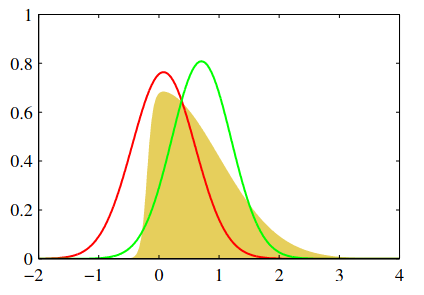
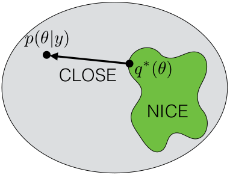

# Approximate Inference

For many interesting models (e.g. neural networks) the evidence  

$$
p(\mathcal{D}|\mathcal{M}_i) = \int p(\mathcal{D}|\mathcal{M}_i, \theta) p(\theta| \mathcal{M}_i) d\theta
$$

is intractable, *i.e* either the integral has no closed-form or the dimensionality is so big that numerical integration is not feasible

> If the evidence is intractable then the posterior is also intractable

In these cases we resort to approximations

- **Stochastic approximation:** For example Markov Chain Monte Carlo (MCMC). MCMC is computationally demanding (for complex models) but produces asymptotically exact samples from the intractable distribution
- **Deterministic approximation:** For example Variational Inference (VI). VI is more efficient than MCMC, but it is not asymptotically exact. Instead of samples we get a direct approximation of the intractable distribution

The main topic of this lecture is deterministic approximations

## The Laplace Approximation

In Bayesian statistics, the Laplace approximation refers to the application of [Laplace](https://en.wikipedia.org/wiki/Pierre-Simon_Laplace)'s method to approximate an intractable integral (evidence) using a Gaussian distribution

In particular, Laplace's method is a technique to solve integrals of the form

$$
f(x) = \int e^{g(\theta)} d\theta,
$$

by defining the auxiliary function as

$$
\begin{split}
g(\theta) &= \log  p(\mathcal{D}| \theta) p(\theta)  \\
&= \log  p(\mathcal{D}| \theta) + \log   p(\theta)  \\
&= \sum_{i=1}^N \log p(x_i |\theta) + \log   p(\theta) 
\end{split}
$$

then $f(x)$ is equivalent to the evidence.

The "approximation" consists of performing a second order Taylor expansion of $g(\theta)$ around $\theta= \hat \theta_{\text{map}}$, i.e. the MAP solution. The result of this is

$$
g(\theta) \approx  g(\hat \theta_{\text{map}}) -  \frac{1}{2} (\theta - \hat \theta_{\text{map}})^T \Lambda (\theta - \hat \theta_{\text{map}})
$$

where

$$
\Lambda = -\frac{d^2 g}{d\theta^2} (\hat \theta_{\text{map}}),
$$ 

is the negative Hessian evaluated at $\hat \theta_{\text{map}}$

:::{note}

By definition the first derivative of $g(\theta)$ evaluated at $\hat \theta_{\text{map}}$ is zero

:::

If we plug the Gaussian approximation back into the evidence we can now solve the integral as

$$
\begin{split}
p(\mathcal{D}) &\approx  e^{g(\hat \theta_{\text{map}})} \int e^{-\frac{1}{2} (\theta - \hat \theta_{\text{map}})^T \Lambda (\theta - \hat \theta_{\text{map}})} d\theta  \\
&= e^{g(\hat \theta_{\text{map}})} (2\pi)^{K/2} |\Lambda|^{-1/2}
\end{split}
$$

where $K$ is the dimensionality of $\theta$. With this the posterior is

$$
\begin{split}
p(\theta| \mathcal{D}) &= \frac{p(\mathcal{D}|\theta) p(\theta) }{p(\mathcal{D})}  = \frac{e^{ g(\theta)}}{\int e^{ g(\theta)} d\theta} = \\
&\approx \frac{1}{(2\pi)^{K/2} |\Lambda|^{-1/2}} e^{-  \frac{1}{2} (\theta - \hat \theta_{\text{map}})^T \Lambda (\theta - \hat \theta_{\text{map}})} 
\end{split}
$$

:::{important}

Laplace's method approximates the posterior by a **Multivariate Gaussian** centered on the MAP. 

:::

:::{warning}

As the following figure shows, Laplace's method might not be the "best" gaussian fit to our distribution

:::

A non-gaussian distribution is shown in yellow. The red line corresponds to a gaussian centered on the mode (Laplace approximation), while the green line corresponds to a gaussian with minimum reverse KL divergence

**Requirement of the Laplace approximation**

For Laplace's approximation the MAP solution and the negative Hessian evaluated at the MAP solution are needed

In the first place $g(\theta)$ has to be continuous and differentiable on $\theta$, and the negative Hessian has to be positive definite

**A closer look to the evidence in Laplace approximation**

Using Laplace approximation the log evidence can be decomposed as

$$
\begin{split}
\log p(\mathcal{D}|\mathcal{M}_i) &\approx g(\hat \theta_{\text{map}}) + \frac{K}{2} \log(2\pi) - \frac{1}{2} \log | \Lambda |  \\
&=\log p(\mathcal{D}|\mathcal{M}_i, \hat \theta_{\text{map}}) + \log p(\hat \theta_{\text{map}}| \mathcal{M}_i) + \frac{K}{2} \log(2\pi) - \frac{1}{2} \log | \Lambda |  
\end{split}
$$

*i.e.* the log evidence is approximated by the best likelihood fit plus the **Occam's factor**

The Occam's factor depends on the

- log pdf of $\theta$: Prior
- number of parameters $K$: Complexity
- second derivative around the MAP: Model uncertainty

**Relationship between the evidence in Laplace approximation and the BIC**

In the regime of very large number of samples ($N$) it can be shown that Laplace's approximations is dominated by

$$
\log p(\mathcal{D}|\mathcal{M}_i) \approx \log p(\mathcal{D}|\mathcal{M}_i, \hat \theta_{\text{mle}}) - \frac{K}{2} \log N, 
$$

where $\theta_{\text{mle}}$ is the maximum likelihood solution.

The expression above is equivalent to the negative of the [Bayesian Information Criterion (BIC)](https://en.wikipedia.org/wiki/Bayesian_information_criterion)

:::{seealso}

- Chapters 27 and 28 of [D. Mackay's book](http://www.inference.org.uk/itprnn/book.pdf)
- Section 28.2 of [D. Barber's book](http://web4.cs.ucl.ac.uk/staff/D.Barber/pmwiki/pmwiki.php?n=Brml.Online)

:::

## Variational Inference 

In this section we review a more general method for deterministic approximation. Remember that we are interested in the (intractable) posterior

$$
p(\theta|\mathcal{D}) = \frac{p(\mathcal{D}|\theta) p(\theta)}{p(\mathcal{D})}
$$

Variational Inference (VI) is a family of methods in which a simpler (tractable) posterior distribution is proposed to "replace" $p(\theta|\mathcal{D})$. This simpler posterior is denoted as $q_\nu(\theta)$ which represents a family of distributions parameterized by $\nu$

> **Optimization problem:** The objective is to find $\nu$ that makes $q$ most similar to $p$

We can formalize this as a KL divergence minimization problem

$$
\hat \nu =  \text{arg}\min_\nu D_{\text{KL}}[q_\nu(\theta) || p(\theta|\mathcal{D})] = \int q_\nu(\theta) \log \frac{q_\nu(\theta)}{p(\theta|\mathcal{D})} d\theta,
$$

but this expression depends on the intractable posterior. To continue we use Bayes Theorem to move the evidence out from the integral

$$
D_{\text{KL}}[q_\nu(\theta) || p(\theta|\mathcal{D})] = \log p(\mathcal{D}) + \int q_\nu(\theta) \log \frac{q_\nu(\theta)}{p(\mathcal{D}, \theta)} d\theta
$$

As $p(\mathcal{D})$ does not depend on $\nu$ we can focus on the right hand term. The optimization problem is typically written as 

$$
\hat \nu =  \text{arg}\max_\nu \mathcal{L}(\nu) =\int q_\nu(\theta) \log \frac{p(\mathcal{D}, \theta)}{q_\nu(\theta)}d\theta
$$

where $ \mathcal{L}(\nu)$ is called the **Evidence Lower BOund** (ELBO). 

The name comes from the fact that 

$$
\log p(\mathcal{D}) \geq  \mathcal{L}(\nu) = \int q_\nu(\theta) \log \frac{p(\mathcal{D}, \theta)}{q_\nu(\theta)}d\theta,
$$

which is a result of the non-negativity of the KL divergence.

> Ideally we choose a "simple-enough" parametric family $q$ so that the ELBO is tractable

:::{note}

The ELBO can only be tight if $p$ is within the family of $q$

:::

:::{seealso}

[Calculus of variations](https://en.wikipedia.org/wiki/Calculus_of_variations): Derivatives of functionals (function of functions)

:::

### More attention on the ELBO 

The ELBO can also be decomposed as 

$$
\begin{split}
\mathcal{L}(\nu) &= \int q_\nu(\theta) \log \frac{p(\mathcal{D}|\theta) p (\theta)}{q_\nu(\theta)}d\theta  \\
&= \int q_\nu(\theta) \log p(\mathcal{D}|\theta) d\theta - \int q_\nu(\theta) \log \frac{q_\nu(\theta)}{ p (\theta)} d\theta   \\
&= \mathbb{E}_{\theta \sim q_\nu(\theta)} \left[\log p(\mathcal{D}|\theta)\right] - D_{KL}[q_\nu(\theta) || p(\theta)]   
\end{split}
$$

From which we can recognize that maximizing the ELBO is equivalent to:

- Maximizing the log likelihood for parameters sampled from the approximate posterior: Generative model produces realistic data samples
- Minimizing the KL divergence between the approximate posterior and prior: Regularization for the approximate posterior

**Another way to "obtain" the ELBO**

We can get the ELBO using [Jensen's inequality](https://en.wikipedia.org/wiki/Jensen%27s_inequality) on the log evidence 

$$
\begin{split}
\log p(\mathcal{D}) &=  \log \mathbb{E}_{\theta\sim p(\theta)} \left[p(\mathcal{D}|\theta)\right]\nonumber \\
&=  \log \mathbb{E}_{\theta\sim q_\nu(\theta)} \left[p(\mathcal{D}|\theta)\frac{p(\theta)}{q_\nu(\theta)}\right] \\
&\geq  \mathbb{E}_{\theta\sim q_\nu(\theta)} \left[\log \frac{p(\mathcal{D},\theta)}{q_\nu(\theta)}\right] =\int q_\nu(\theta) \log \frac{p(\mathcal{D},\theta)}{q_\nu(\theta)}d\theta  
\end{split}
$$

### A simple posterior: Fully-factorized posterior

A broadly-used idea to make posteriors tractable is to assume that there is no correlation between factors 

$$
q_\nu(\theta) = \prod_{i=1}^K q_{\nu}(\theta_i), 
$$

this is known as the **Mean-field** VI

Replacing this factorized posterior on the ELBO

$$
\begin{split}
\mathcal{L}_\text{MF}(\nu) &= \int  \prod_{i=1}^K q_{\nu}(\theta_i) \left ( \log p(\mathcal{D}, \theta) - \sum_{i=1}^K \log q_{\nu}(\theta_i) \right) d\theta   \\
&= \int q_{\nu_i}(\theta_i) \left [ \int \prod_{j\neq i} q_{\nu_j}(\theta_j) \log p(\mathcal{D}, \theta) d\theta_j \right ] d\theta_i - \sum_{i=1}^K \int q_{\nu_i}(\theta_i) \log q_{\nu_i}(\theta_i)  d\theta_i  \\
\end{split}
$$

Asumming that we keep all $\theta$ except $\theta_i$ fixed, we can update $\theta_i$ iteratively using

$$
\mathcal{L}_\text{MF}(\nu_i) =  \int q_{\nu_i}(\theta_i) \mathbb{E}_{\prod q_{i\neq j}} \left[ \log p(\mathcal{D},\theta) \right ] d\theta_i - \int q_{\nu_i}(\theta_i) \log q_{\nu_i}(\theta_i)  d\theta_i + \text{Constant}  
$$

:::{note}

(In this case) Maximizing the ELBO is equivalent to minimizing the KL between $q_{\nu_i}(\theta_i)$ and $\mathbb{E}_{\prod q_{i\neq j}} \left[ p(\mathcal{D}, \theta) \right ]$

:::

The optimal $q$ in this case is given by

$$
q_i(\nu_i) \propto  \exp \left ( \mathbb{E}_{\prod q_{i\neq j}} \left[ p(\mathcal{D}, \theta) \right ] \right )
$$

:::{seealso}

- Chapters 33 of [D. Mackay's book](http://www.inference.org.uk/itprnn/book.pdf)
- Section 28.4 of [D. Barber's book](http://web4.cs.ucl.ac.uk/staff/D.Barber/pmwiki/pmwiki.php?n=Brml.Online)
- David Blei, ["Variational Inference: A review for statisticians"](https://arxiv.org/abs/1601.00670), ["Foundations and innovations"](https://www.youtube.com/watch?v=DaqNNLidswA)
- Tamara Broderick, ["Variational Bayes and beyond: Bayesian inference for big data"](http://www.tamarabroderick.com/tutorial_2018_icml.html)

:::

